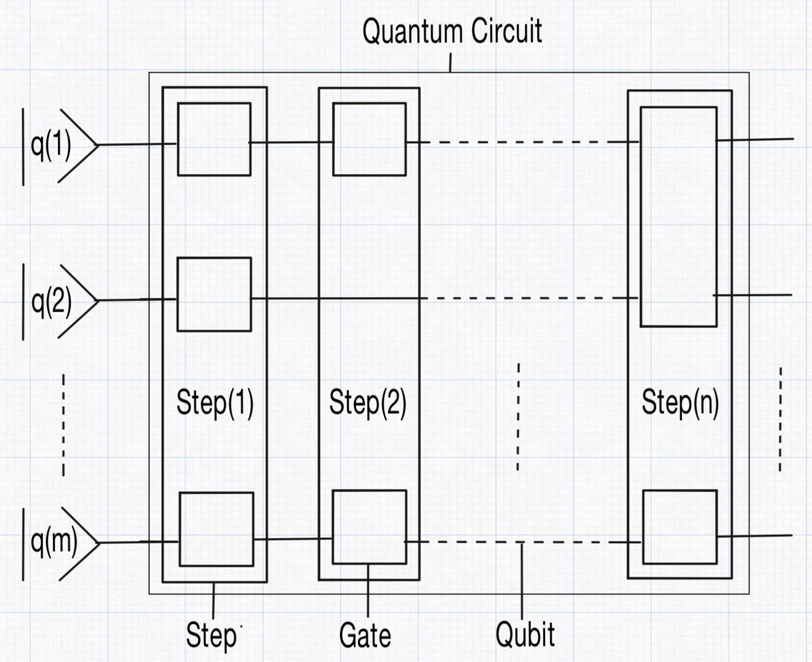
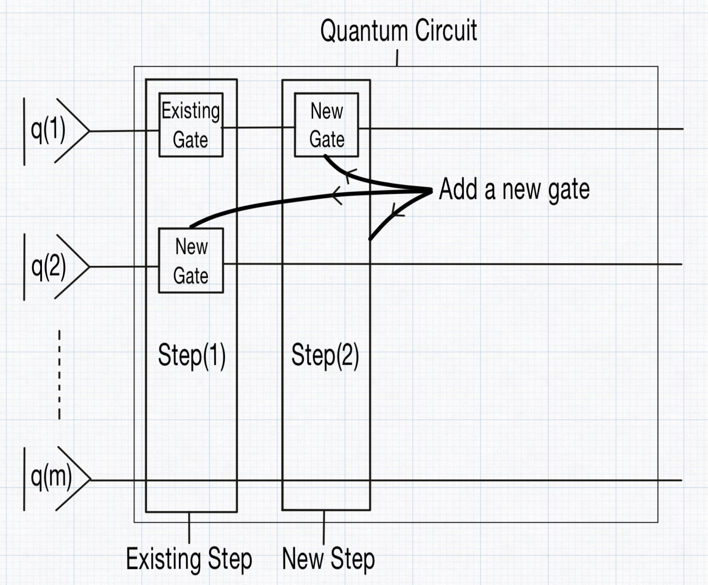

# How you define the quantum circuit

In QubiSim, a [`QuantumCircuit`](@ref) is made up of a collection of qubits and a sequence of steps. Each step represents an abstract slice of time during which certain operations occur. In this context, an "abstract time slice" refers to a conceptual moment in the quantum circuit's evolution, rather than a specific or measurable duration. During each step, a set of quantum gates is applied to the qubits simultaneously, meaning all the gates within that step operate in parallel, but only within that abstract moment. Each gate in a step acts on a specific subset of the qubits, and QubiSim supports three types of gates: [`UnitaryGate`](@ref), [`MeasureGate`](@ref) and a [`QuantumChannelGate`](@ref). However, all gates in a single step must belong to the same category; different types cannot be mixed within the same step. The package provides a wide range of built-in unitary gate options for users to choose from.

A new [`QuantumCircuit`](@ref) is created with [`createQuantumCircuit`](@ref). With the optional parameters `zeroBasedNumbering::Bool` and [`IndexType`](@ref) you can define the qubit indexing settings. Qubit indices start from 0 if `zeroBasedNumbering` is set to `True`, otherwise they start from 1. [`IndexType`](@ref) defines if qubits are indexed in circuit-form (`BigEndian` = default or `LittleEndian`) or in byte-form. Another way of creating a [`QuantumCircuit`](@ref) can be done with [`createQuantumCircuitWithSettings`](@ref) by providing [`Settings`](@ref) with [`createSettings`](@ref).

QubiSim provides functions to add gates to the [`QuantumCircuit`](@ref). These gates are positioned in the circuit in the same way as blocks fall in their place in the game of **Tetris**. A new gate is either placed in a new step and appended to the circuit, or merged into an existing step.

The following [`UnitaryGate`](@ref)s are provided:

1. Single-qubit gates: [`u1Gate!`](@ref), [`u2Gate!`](@ref), [`u3Gate!`](@ref), [`xGate!`](@ref), [`yGate!`](@ref), [`zGate!`](@ref), [`hGate!`](@ref), [`idGate!`](@ref), [`rxGate!`](@ref), [`ryGate!`](@ref), [`rzGate!`](@ref), [`rotationGate!`](@ref), [`projectionGate!`](@ref), [`tGate!`](@ref), [`tdGate!`](@ref), [`sGate!`](@ref), [`sdGate!`](@ref)

2. Double-qubit gates: [`cnotGate!`](@ref), [`cnotReverseGate!`](@ref), [`swapGate!`](@ref), [`phaseGate!`](@ref), [`controlledHGate!`](@ref), [`controlledXGate!`](@ref), [`controlledYGate!`](@ref), [`controlledZGate!`](@ref), [`controlledTGate!`](@ref), [`controlledTdGate!`](@ref), [`controlledSGate!`](@ref), [`controlledSdGate!`](@ref)

3. N-qubit gates: [`unitaryUGate!`](@ref), [`reflectionGate!`](@ref), [`expHGate!`](@ref), [`qftGate!`](@ref), [`iqftGate!`](@ref), [`controlledUGate!`](@ref), [`qpeGate!`](@ref)

Use [`measureGate!`](@ref) to add a [`MeasureGate`](@ref). QubiSim supports two types of quantum measurements: 
- **projective measurement (PVM)** defined by the list of single qubit measure direction operators [`Sigmas`](@ref). They can be constructed with [`sigmaX`](@ref), [`sigmaY`](@ref), [`sigmaZ`](@ref) or more general with [`sigmaN`](@ref).
- **generalized measurement (POVM)** defined by the [`KrausOperators`](@ref). With [`generateKrausOperatorsForPVMMeasurement`](@ref) you can create the Kraus operators for a **projective measurement (PVM)** which is a special case of the **generalized measurement (POVM)**.

Use [`quantumChannelGate!`](@ref) to add a [`QuantumChannelGate`](@ref). The quantum channel gate is defined by the [`KrausOperators`](@ref). With [`generateKrausOperatorsForDepolarizingChannel`](@ref), [`generateKrausOperatorsForPhaseDampingChannel`](@ref) and [`generateKrausOperatorsForAmplitudeDampingChannel`](@ref) you can create the Kraus operators for a **depolarizing quantum channel**, **phase damping quantum channel** and **amplitude damping quantum channel**, respectively.

A [`barrier!`](@ref) can be added to the [`QuantumCircuit`](@ref) to visually and functionally separate different sections (steps) of the circuit. They are primarily used for clarity and control over gate execution order in the circuit, without affecting the quantum state.

With [`concatenateQuantumCircuits`](@ref) you can concatenate two given quantum circuits. Use [`inverseQuantumCircuit`](@ref) to construct the reversed quantum circuit of a given quantum circuit. To create the Quantum circuit for a Fourier Transform or its inverse use [`createNQubitQFTQuantumCircuit`](@ref) or [`createNQubitIQFTQuantumCircuit`](@ref). With [`createNQubitQPEQuantumCircuit`](@ref) you can create a quantum circuit for a quantum phase estimation. Given a [`QuantumCircuit`](@ref), a specific step can be retrieved with [`getStep`](@ref) from which a specific gate can be retrieved with [`getGate`](@ref) from which the specific connected qubits can be retrieved with [`qubits`](@ref).
