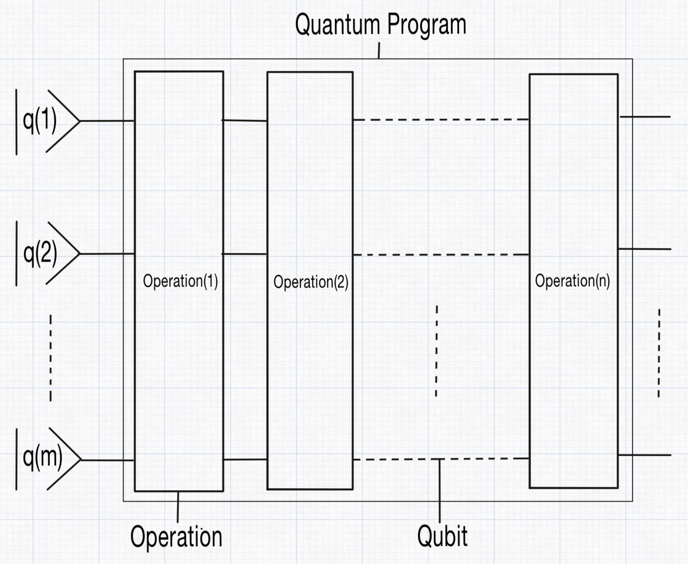
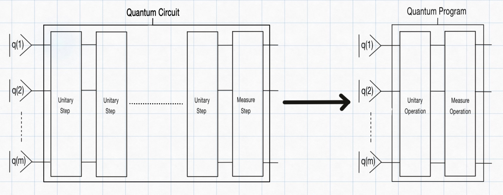

# How you compile the quantum circuit into a quantum program

Given a [`QuantumCircuit`](@ref), the compilation with [`compileQuantumCircuit`](@ref) converts each step in the circuit into a corresponding operation. This process is performed for every step, and the full sequence of these operations is called a [`QuantumProgram`](@ref) in QubiSim.

QubiSim supports four types of operations: [`UnitaryOperation`](@ref), [`MeasureOperation`](@ref), [`MeasureAndForgetOperation`](@ref) and [`QuantumChannelOperation`](@ref). In steps with unitary gates, the compilation process constructs a single [`UnitaryOperation`](@ref) by taking the [`tensorProduct`](@ref) of the individual unitary matrices for each gate in that step.

QubiSim also offers an optimization feature: calling [`compileQuantumCircuit`](@ref) with the `optimizeNumberOfSteps` option set to true, consecutive steps containing only unitary gates can be merged (fused) into one operation. This combined operation is created by sequentially multiplying the unitary matrices, thereby reducing the number of operations in the final quantum program for potentially more efficient execution.

When a step includes measure gates, the compiler creates a [`MeasureOperation`](@ref) or [`MeasureAndForgetOperation`](@ref) (depending on whether the measurement outcome is revealed to the observer or not) that holds the [`KrausOperators`](@ref). If the measurement outcome is revealed to the observer, the post-measurement state will be collapsed to one of the possible outcomes. If it is not revealed, the post-measurement state will be a mixed state over all possible outcomes. For a **projective measurement (PVM)**, the compiler automatically generates the equivalent [`KrausOperators`](@ref), effectively converting it into a **generalized measurement (POVM)**. For a **generalized measurement (POVM)**, the supplied [`KrausOperators`](@ref) are used directly.

In steps with a quantum channel gate, the compiler creates a [`QuantumChannelOperation`](@ref) that holds the [`KrausOperators`](@ref).

QubiSim provides functions to create various operations:

1. Single-qubit operations: [`createSingleQubitOperationU1`](@ref), [`createSingleQubitOperationU2`](@ref), [`createSingleQubitOperationU3`](@ref), [`createSingleQubitOperationX`](@ref), [`createSingleQubitOperationY`](@ref), [`createSingleQubitOperationZ`](@ref), [`createSingleQubitOperationH`](@ref), [`createSingleQubitOperationId`](@ref), [`createSingleQubitOperationRx`](@ref), [`createSingleQubitOperationRy`](@ref), [`createSingleQubitOperationRz`](@ref), [`createSingleQubitOperationRotation`](@ref), [`createNQubitOperationProjection`](@ref), [`createSingleQubitOperationT`](@ref), [`createSingleQubitOperationTd`](@ref), [`createSingleQubitOperationS`](@ref), [`createSingleQubitOperationSd`](@ref)

2. Double-qubit operations: [`createDoubleQubitOperationCNOT`](@ref), [`createDoubleQubitOperationCNOTReverse`](@ref), [`createDoubleQubitOperationSWAP`](@ref), [`createDoubleQubitOperationPhase`](@ref), [`createDoubleQubitOperationControlledH`](@ref), [`createDoubleQubitOperationControlledX`](@ref), [`createDoubleQubitOperationControlledY`](@ref), [`createDoubleQubitOperationControlledZ`](@ref), [`createDoubleQubitOperationControlledT`](@ref), [`createDoubleQubitOperationControlledTd`](@ref), [`createDoubleQubitOperationControlledS`](@ref), [`createDoubleQubitOperationControlledSd`](@ref)

3. N-qubit operations: [`unitaryUGate!`](@ref), [`createNQubitOperationReflection`](@ref), [`createNQubitOperationExpH`](@ref), [`createNQubitOperationQFT`](@ref), [`createNQubitOperationIQFT`](@ref), [`createNQubitOperationControlledU`](@ref), [`createNQubitOperationQPE`](@ref)

Use [`compileToSingleGate`](@ref) to compile a given quantum circuit (containing only [`UnitaryGate`](@ref)s) into a single operation. Given a [`QuantumProgram`](@ref), a specific operation can be retrieved with [`getOperation`](@ref).
