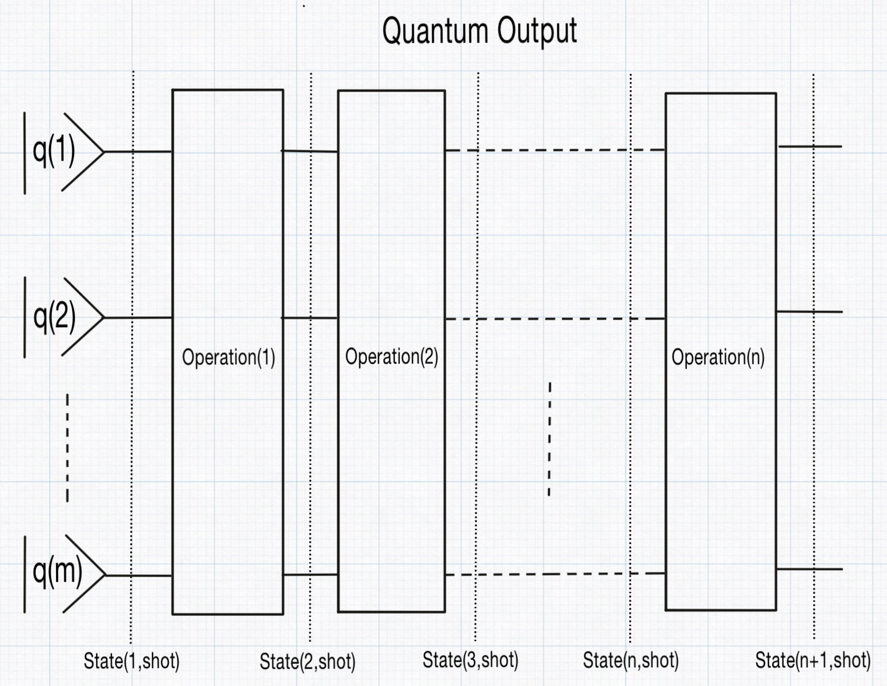

# How you execute the quantum program on quantum states

Given a [`QuantumProgram`](@ref) and an initial qubit state, the program can be executed using [`runQuantumProgram`](@ref). This execution sequentially applies each time-ordered operation in the program to the qubit state, starting from the initial state. The process transforms the state step by step into a new qubit state, which constitutes a single execution step. However, due to the inherent probabilistic nature of quantum computing — particularly the randomness in measurements and the subsequent state collapse — one execution step does not provide sufficient data for meaningful statistical analysis. To address this, the single execution step is repeated multiple times, as specified by the nrOfShots parameter.

In QubiSim, the output of [`runQuantumProgram`](@ref) is a [`QuantumOutput`](@ref), which contains a two-dimensional array of states. The first index of this array corresponds to the qubit state after each time-ordered operation in the program, with the first entry representing the initial qubit state. The second index represents the repetitions of the single execution step, aka the shot.

QubiSim supports two types of states: state vectors ([`VectorState`](@ref)) and density operators ([`DensityState`](@ref)). If a time-ordered operation in the program is a [`MeasureOperation`](@ref) (the measurement result IS revealed to the observer), its result is stored in the [`Measured`](@ref) field of the state; otherwise, this field is set to nothing. The state type used throughout the program execution is determined by the type of the initial qubit state, which can be created using [`createInitialQubitState`](@ref). For a [`DensityState`](@ref), the state includes not only the density operator but also the calculated entropy and purity values (calculated with [`calculateEntropyAndPurity`](@ref)).

A given [`QuantumOutput`](@ref) allows you to retrieve specific data as follows: use [`getState`](@ref) to access a particular state across all shots, [`getShot`](@ref) to access a specific shot across all states, and [`getStateShot`](@ref) to retrieve a specific state and shot combination.

With [`convertVectorStateToDensityState`](@ref) you can convert a [`VectorState`](@ref) into its corresponding pure [`DensityState`](@ref). The function [`createByteIndexVector`](@ref) facilitates easy creation of the right initial qubit state in [`createInitialQubitState`](@ref). With the functions [`createDoubleQubitWernerDensityState`](@ref) and [`createSingleQubitBlochDensityState`](@ref) you can create dedicated Werner and Bloch density states, respectively.
