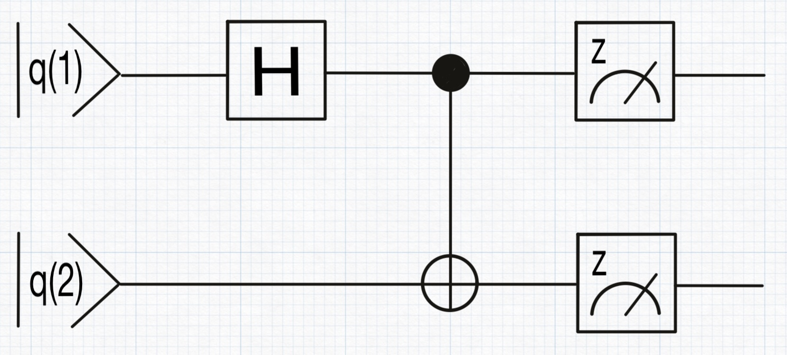
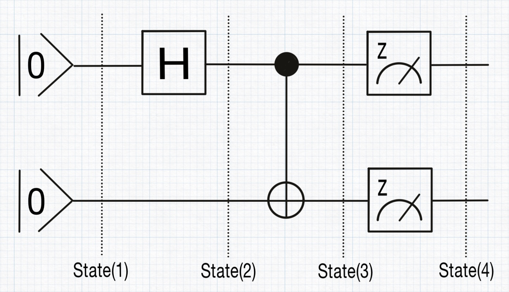
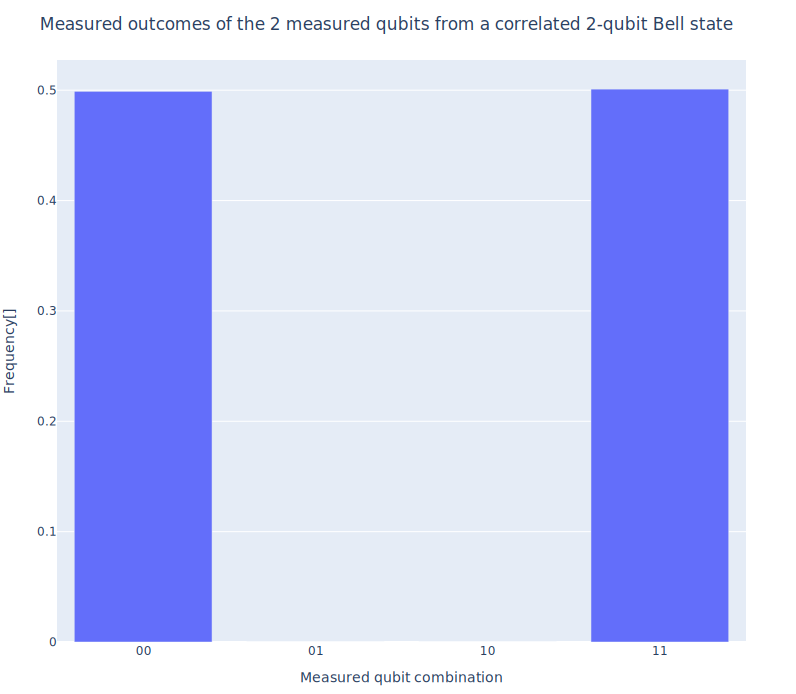

# A step-by-step detailed walkthrough

Before diving into the specifics of QubiSim, let’s first explore a high-level overview of its structure and capabilities with a simple example. We'll demonstrate how to use QubiSim by plotting a histogram of simulated measurement outcomes for a correlated two-qubit Bell state.

We begin by creating an empty two-qubit quantum circuit, `qc`.
```julia-repl
julia> qc = createQuantumCircuit(2)
```
To form the Bell state, we add a Hadamard gate to qubit q(1) and a controlled-NOT gate between qubits q(1) and q(2). This setup entangles the qubits, creating the Bell state.
```julia-repl
julia> hGate!(qc, 1)
julia> cnotGate!(qc, 1, 2)
```
Next, we add measurement gates to both qubits, which will allow us to observe their states.
```julia-repl
julia> measureGate!(qc, [1, 2])
```


After setting up the circuit, we compile `qc` into a quantum program `qp`. This compilation process translates the gates into time-ordered operations: the Hadamard and controlled-NOT gates are converted into their corresponding unitary matrix representations, while the measurement gates are transformed into a projective orthogonal eigenbasis representing the set of states into which the system can collapse upon measurement.
```julia-repl
julia> qp = compileQuantumCircuit(qc)
```
With the quantum program ready, we initiate the simulation by creating an initial zero qubit state vector, `iqs`.
```julia-repl
julia> iqs = createInitialQubitState(vector, [1. 0.; 1. 0.])
```
We then execute the quantum program qp on the initial state `iqs`. In a single execution, each time-ordered operation in the program is applied sequentially to the qubit state, transforming it step by step into a new state. Due to the probabilistic nature of quantum computing, particularly the randomness inherent in the measurement step and the subsequent collapse of the state, a single execution does not yield sufficient information for meaningful statistics. Therefore, we repeat this process 1,000 times. The result is collected in a quantum output `qo`.
```julia-repl
julia> qo = runQuantumProgram(qp, iqs, 1000)
```
From this output, we can extract the collapsed state after the measurement gates (state 4), along with the intermediate states: the initial state (state 1), the state after the Hadamard gate (state 2), and the state after the controlled-NOT gate (state 3).



Finally, we plot a histogram of the simulated measurement outcomes for the two qubits, illustrating the correlation inherent in the Bell state.
```julia-repl
julia> probeMeasureOutcome(qo, 4, "Measured outcomes of the 2 measured qubits from a correlated 2-qubit Bell state")
```


In the following sections, we will delve deeper into the structure of the quantum algorithm simulation and explore the full range of functionalities provided by QubiSim.
